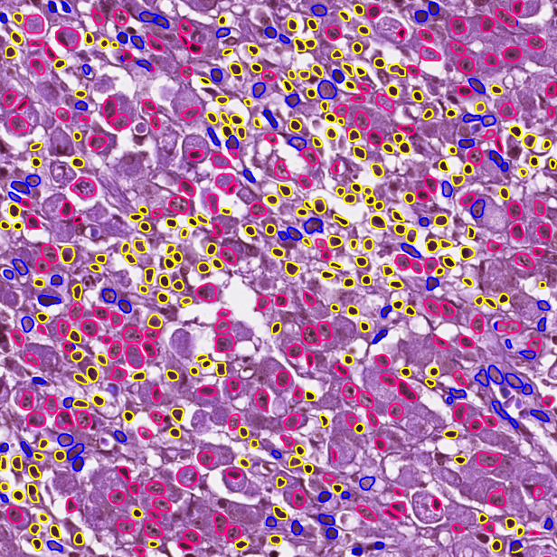
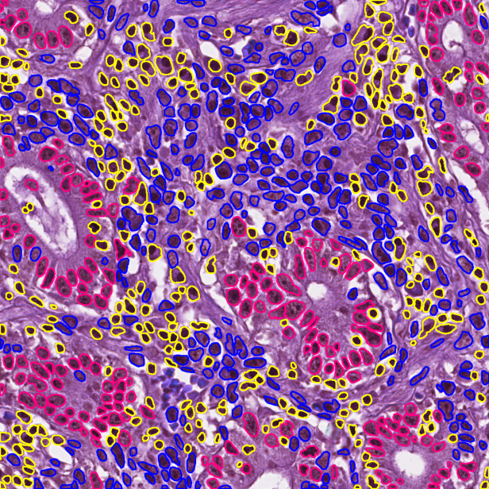

# Sonnet: A self-guided ordinal regression neural network for segmentation and classification of nuclei in large-scale multi-tissue histology images

## Overview

This repository contains a tensorflow implementation of SONNET: a self-guided ordinal regression neural network that performs simultaneously nuclei segmentation and classification. By introducing a distance decreasing discretization strategy, the network can detect nuclear pixels (inner pixels) and high uncertainty regions (outer pixels). The self-guided training strategy is applied to high uncertainty regions to improve the final outcome. <br />
As part of this research, we introduce a new dataset for Gastric Lymphocyte Segmentation And Classification (GLySAC), which includes 59 H&E stained image tiles, of size 1000x1000. More details can be found in the SONNET paper. 

The repository includes:
- Source code of SONNET.
- Training code for SONNET.
- Datasets employed in the SONNET paper.
- Pretrained weights for the SONNET encoder.
- Evaluation on nuclei segmentation metrics (DICE, AJI, DQ, SQ, PQ) and nuclei classification metrics (Fd and F1 scores).

## Installation
```
conda create --name sonnet python=3.6
conda activate sonnet
pip install -r requirements.txt
```

## Dataset
Download the CoNSeP dataset from this [link](https://warwick.ac.uk/fac/sci/dcs/research/tia/data/hovernet/). <br />
Download the PanNuke dataset from this [link](https://warwick.ac.uk/fac/cross_fac/tia/data/pannuke) <br />
Download the MoNuSAC and GLySAC from this [link](https://drive.google.com/drive/folders/1p0Yt2w8MTcaZJU3bdh0fAtTrPWin1-zb?usp=sharing) <br />


## Step by Step Instruction
To help with debugging and applying the model for nuclei segmentation and classification, it requires four steps:

### Step 1: Extracting the original data into patches
To train the model, the data needs to be extracted into patches. First, set the dataset name in ```config.py```. Then, To extract data into patches for training, simply run: <br />
`python extract_patches.py` <br />
The patches are numpy arrays with the shape of [RGB, inst, type], where RGB is the input image, inst is the foreground/background groundtruth, type is the type groundtruth map. 

### Step 2: Training the model
Download the pretrained-weights of the encoder used in SONNET on this [link](https://drive.google.com/drive/folders/1p0Yt2w8MTcaZJU3bdh0fAtTrPWin1-zb?usp=sharing) <br />
Before training the network:
- Set the training dataset and validation dataset path in `config.py`.
- Set the pretrained-weights of the encoder in `config.py`.
- Set the log path in `config.py`.
- Change the hyperparameters used in training process according to your need in `opt/hyperconfig.py`. <br />
To train the network with GPUs 0 and 1:
```
python train.py --gpu='0,1'
```
### Step 3: Inference
Before testing the network on the test dataset:
- Set path to the test dataset, path to the model trained weights, path to save the output in `config.py`.
Achieve the network prediction by the command: 
```
python infer.py --gpu='0'
```
It is notice that the inference only support for 1 GPU only. <br />
To obtain the final outcome, i.e. the instance map and the type of each nuclear, run the command:
```
python process.py
```
### Step 4: Calculate the metrics
To calculate the metrics used in SONNET paper, run the command:
- instance segmentation: `python compute_stats.py --mode=instance --pred_dir='pred_dir' --true_dir='true_dir'`
- type classification: `python compute_stats.py --mode=type --pred_dir='pred_dir' --true_dir='true_dir'`

## Visual Results
<table border="0">
<tr>
    <td>
    
    </td> 
    <td>
     
    </td>
</tr>
</table>

Type of each nuclear is represented by the color: <br />
- Pink for Epithelial. <br />
- Yellow for Lymphocyte. <br />
- Blue for Miscellaneous. <br />

## Requirements
Python 3.6, Tensorflow 1.12 and other common packages listed in requirements.txt

## Citation
The datasets that we used in SONNET are from these papers:
- CoNSeP: [paper](https://www.sciencedirect.com/science/article/pii/S1361841519301045).
- MoNuSAC: [paper](https://ieeexplore.ieee.org/document/9446924).
- PanNuke: [paper](https://arxiv.org/abs/2003.10778). <br />

If you use any of these dataset for your research, please have a citation of it.

